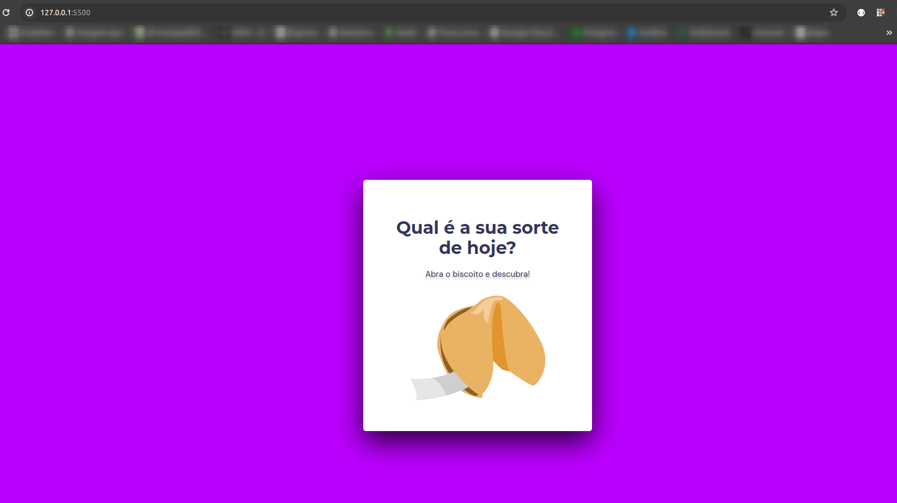
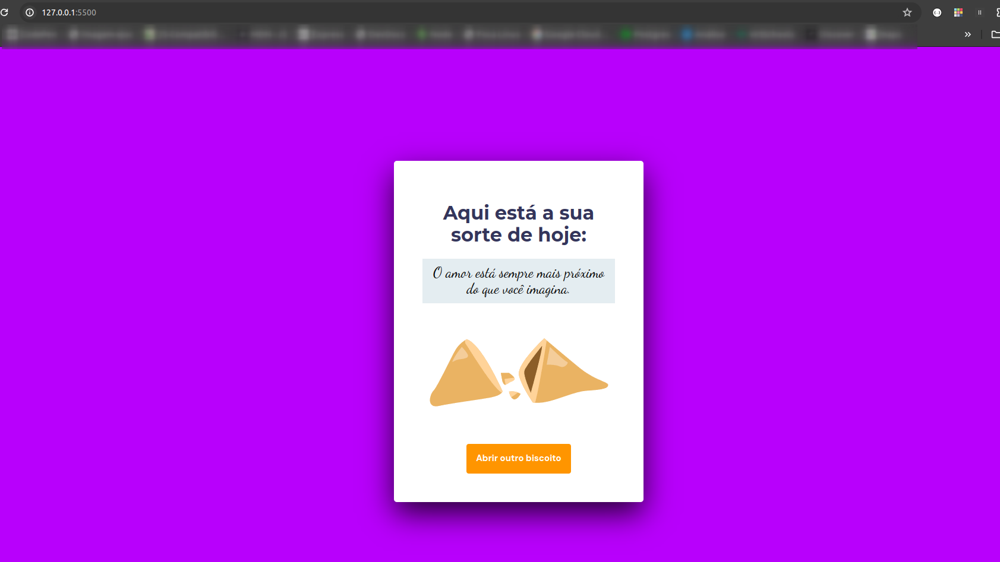

# Biscoito da Sorte

O intuito do projeto é reproduzir um biscoito da sorte virtual, ao clicar na imagem do biscoito na primeira tela uma frase é mostrada na segunda tela.
O projeto contém algumas animações aplicadas com CSS animation. Também Utilizei JavaScript para realizar as interações com o usuário e fazer a mudança de página.

Clique <a target="_blank" href="https://codepen.io/jean_88asl/pen/jOJbLOK?editors=1010">aqui</a> para saber a frase de sorte e ver o projeto funcionando!

Primeira página:

  

Segunda página:

  

Esse projeto foi desenvolvido com as seguintes tecnologias:

- HTML e CSS
- JavaScript
- Git e Github
- Figma

